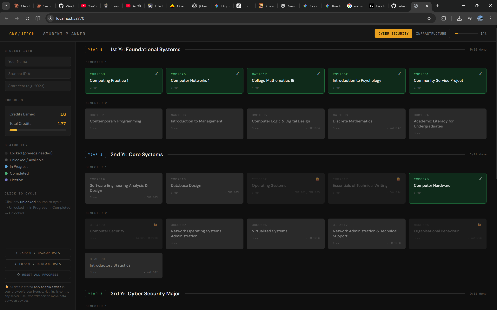
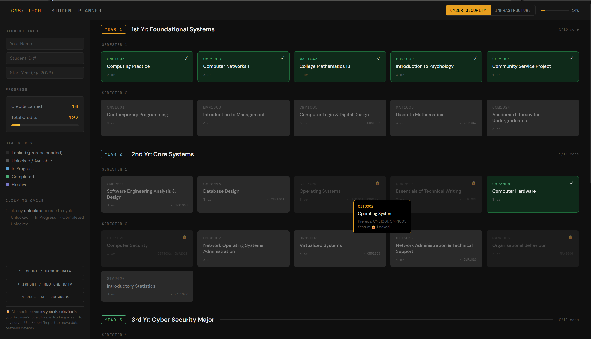
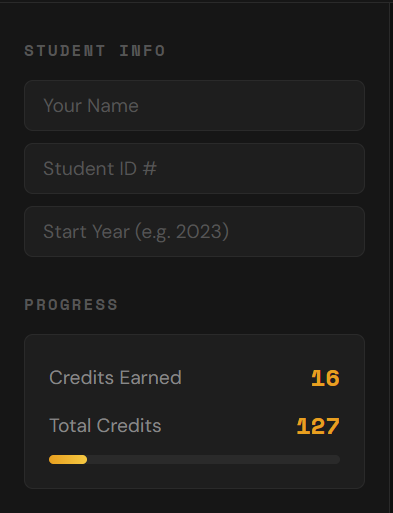
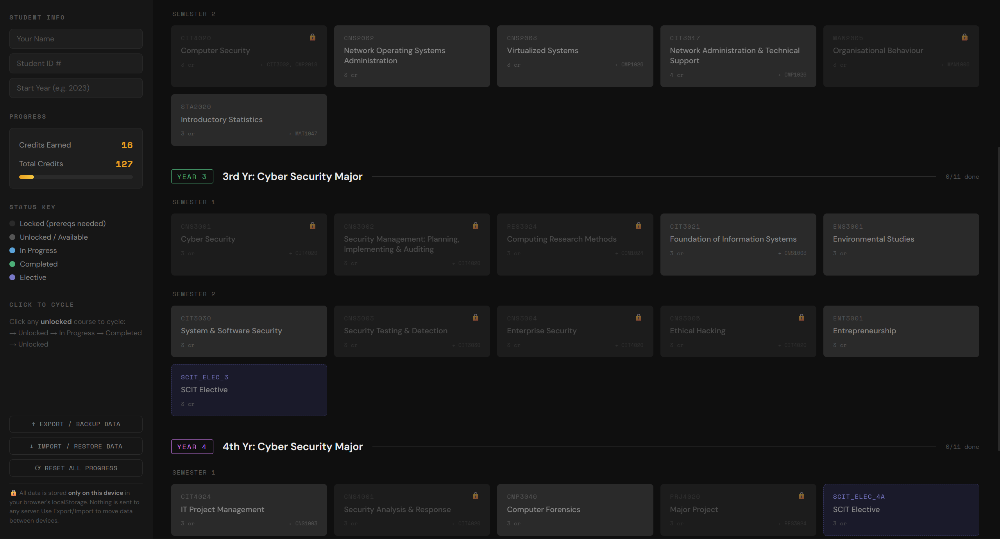
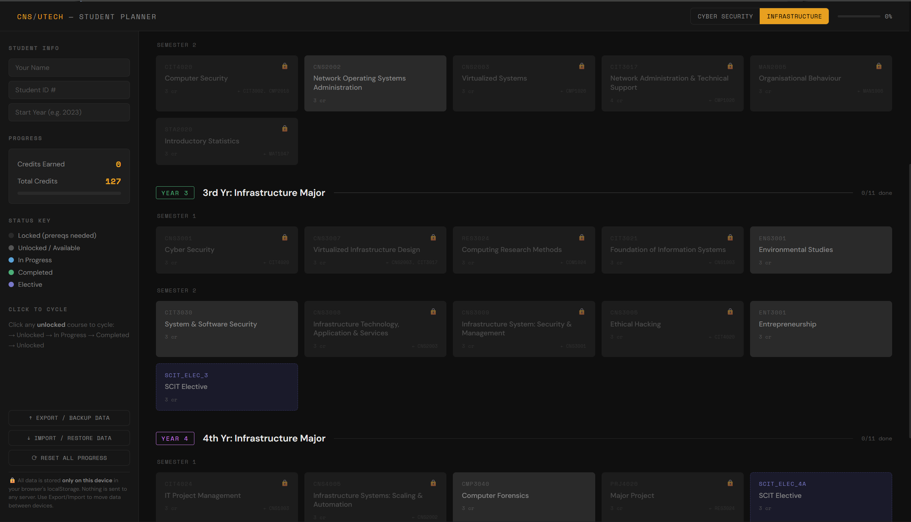

# utech-cns-planner

> An interactive degree-progress tracker for UTech Jamaica BSc CNS students — Cyber Security and Infrastructure tracks.



---

## What It Does

Click any unlocked course to cycle its status: **Available → In Progress → Completed**.  
Prerequisite courses unlock automatically as you complete their dependencies.  
Credits and overall percentage update in real time.

**No account. No server. Nothing leaves your browser.**

---

## Features

| Feature | Detail |
|---|---|
| 🎓 Two tracks | Cyber Security & Infrastructure |
| 🔒 Prereq locking | Courses unlock only when dependencies are met |
| 📊 Live credit counter | Tracks earned vs. total credits |
| 💾 Offline-first | All data in `localStorage` — works without internet |
| 📤 Export / Import | JSON backup so you can move data between devices |
| 🔐 XSS-safe | All output escaped; no user data ever hits a server |

---

## Screenshots

| View | Description |
|---|---|
|  | 1 and 2 year of Full 4-year plan — Cyber Security track |
|  | Locked courses with tooltip showing missing prereqs |
|  | Sidebar credits counter updating after completions |
|  | 3-4 year Cyber Security track|
|  | Infrastructure track selected |


---

## How to Use

1. **Open** `index.html` in any browser — no install needed.
2. **Select your track** (Cyber Security or Infrastructure) in the top-right.
3. **Click a course** to mark it In Progress, then Completed.
4. **Export** your progress via the sidebar to back it up or move to another device.

---

## Local Development

```bash
git clone https://github.com/YOUR_USERNAME/utech-cns-planner.git
cd utech-cns-planner
# Open index.html in your browser — that's it.
```

No build step. No dependencies. Pure HTML/CSS/JS.

---

## Project Structure

```
utech-cns-planner/
├── index.html          # Entire app — single file
├── screenshots/        # README screenshots
│   ├── full-view.png
│   ├── prereq-lock.png
│   ├── credits-sidebar.png
│   ├── infra-track.png
|   └── cyber-track.png
└── README.md
```

---

## Curriculum Data

Course data is sourced from the official **UTech Jamaica BSc CNS** programme structure (2023 intake).  
Both programme variants are included:
- `BSc CNS — Cyber Security`
- `BSc CNS — Infrastructure`

---

## Security Notes

- All HTML output is escaped with a custom `esc()` function.
- `localStorage` reads are validated — only whitelisted shapes are accepted.
- No external API calls. CSP meta tag blocks external script injection.
- Student info is stripped of HTML tags before storage.

---

## Contributing

Found a course discrepancy? Open an issue or pull request.  
Contributions welcome — especially if UTech updates the programme structure.

---

## License

MIT — free to use, share, and modify.

---

*Built for UTech Jamaica CNS students. Not an official UTech product.*